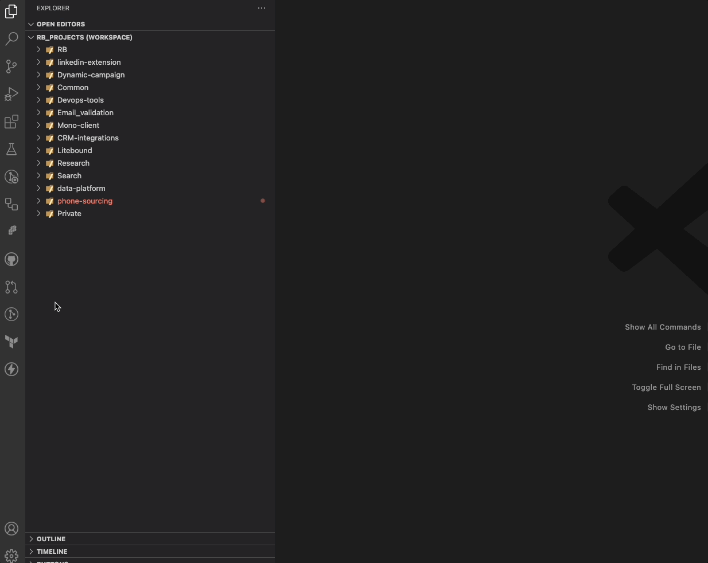
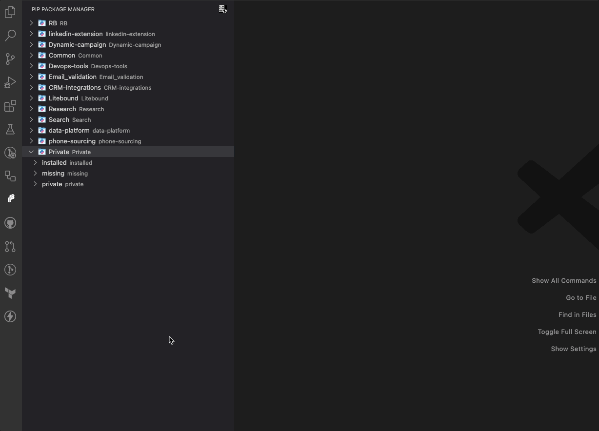

# Pip Package Manger Extension
 

## Description

This is a [Visual Studio Code](https://code.visualstudio.com/) [extension](https://marketplace.visualstudio.com/) that provides the ability to view and manage all of your Python projects (workspaces) & Pip packages imports from a single place.

## Features

- List all your Workspaces.

- Scan each Workspace, and produce a list of imports with the following criteria: *installed*, *missing*, *private*.
- Install all missing pip packages imports.
- Install a desired package from [Pypi](https://pypi.org/).
- Update an installed package to the latest version.

## Usage

1. Once you click on the extension's side bar, the extension will start to scan all your projects workspaces.
2. After done, you can click on one folders, to run a scan for all imports of this project.
3. This will result in a list of all imports (according to the criteria: *installed*, *missing*, *private*).
**Note**: If we were unable to find any missing imports, you will not see a list of: *missing*.

## Notes
Under the hood, the extension utilize the [Pylance](https://marketplace.visualstudio.com/items?itemName=ms-python.vscode-pylance) and [Python](https://marketplace.visualstudio.com/items?itemName=ms-python.python) extensions. You will not be able to run this extension without it.

## Extension Settings

This extension contributes the following settings:

- `pipPackageManager.followSymbolicLinks`: Control if we search through symbolic links folders inside your projects.

## Contributing

Contributions are welcome! If you find any issues or have suggestions for improvements, please submit them in the repository page.
